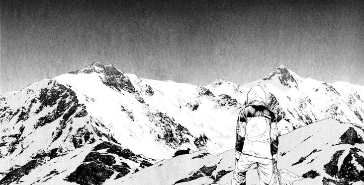

  

 

<h3 align="center">
  <code>
    user@vinci:~$ whoami 
    > Rust Apprentice & Blockchain Enthusiast 
     
    user@vinci:~$ cat mission.txt 
    > Transforming chaos into strict logic. 
    > Exploring Arch Linux, Systems & Cryptography.
  </code>
</h3>

 

  
  
  
  

 

  
  

